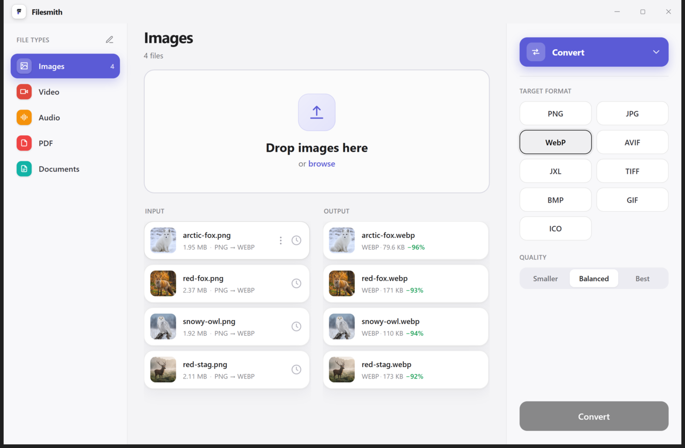
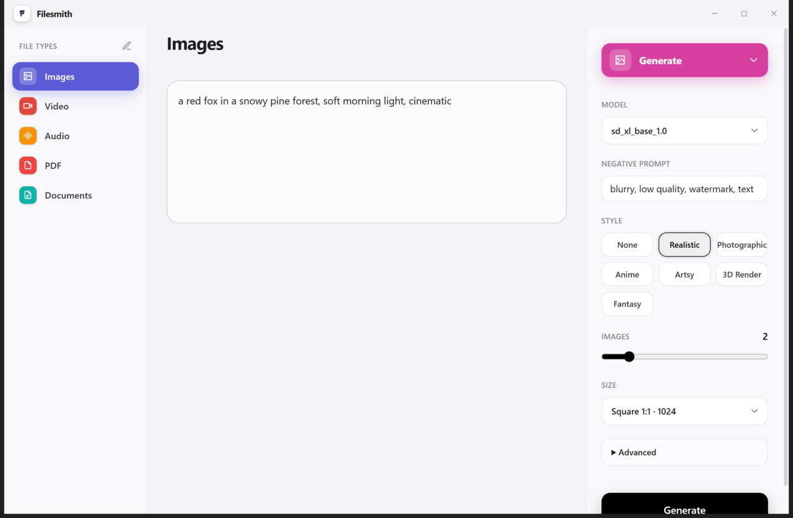
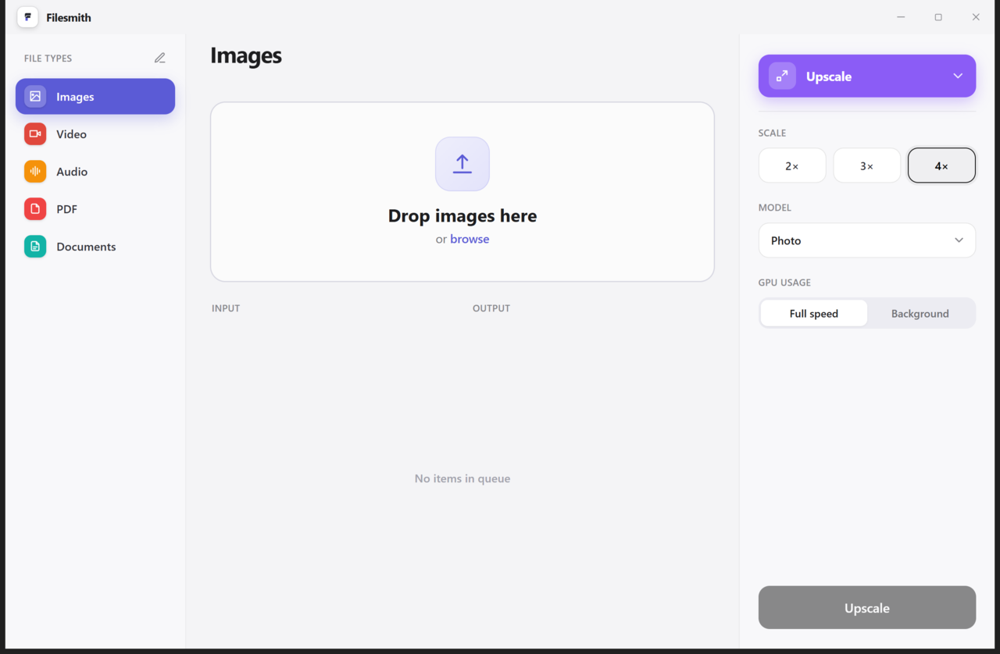
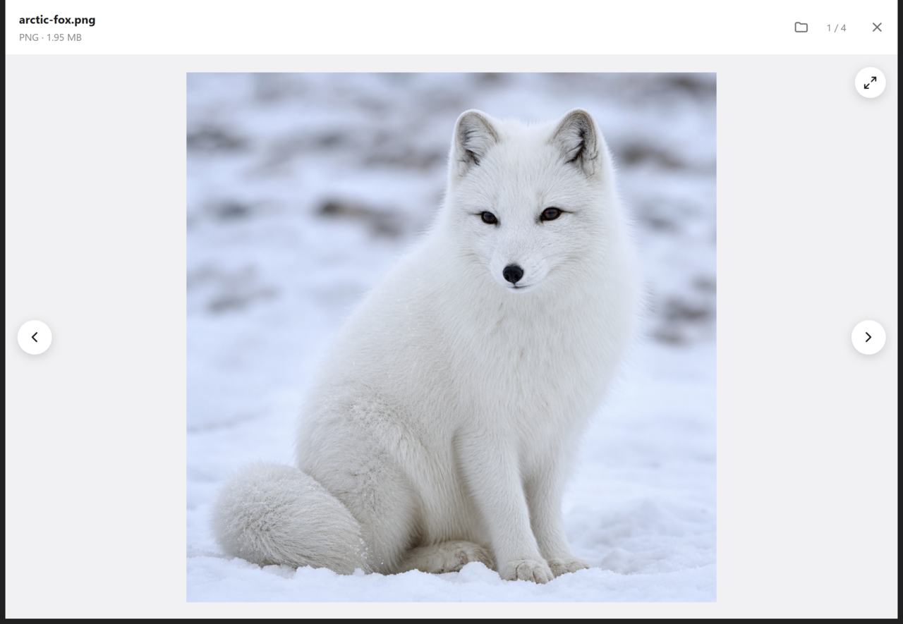
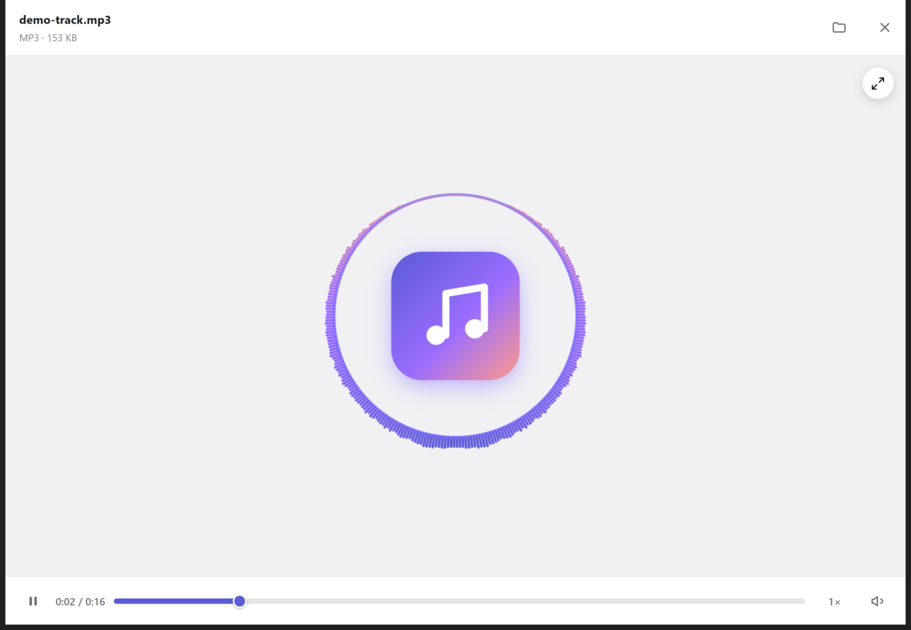

<div align="center">
  

# Filesmith

A local file toolkit for Windows. Drop files, pick a tool, get results.

[](https://github.com/Maxaubert/Filesmith/releases/latest)
[](https://github.com/Maxaubert/Filesmith/releases)
[](https://github.com/Maxaubert/Filesmith/releases/latest)
[](#build-from-source)
[](LICENSE)
</div>

---

<p align="center">
  
</p>

<table align="center">
  <tr>
    <td align="center"><br><sub><b>Generate</b> — text to image</sub></td>
    <td align="center"><br><sub><b>Upscale</b> — 2–4× with a GPU model</sub></td>
  </tr>
  <tr>
    <td align="center"><br><sub><b>Image viewer</b> — zoom, pan, page through the batch</sub></td>
    <td align="center"><br><sub><b>Audio viewer</b> — a live circular visualizer</sub></td>
  </tr>
</table>

## What it is

Filesmith puts the everyday file jobs behind one clean window. Pick **what you want done** - convert, compress, resize, and more - then drop files of any supported type: **images, video, audio, PDFs, documents, and archives**. Drop a pile of files, pick a tool, and it runs the batch with thumbnails, live per-file progress, rich previews, and collision-safe output that never overwrites your originals.

Everything runs **locally on your machine**, and your queue and produced files are **remembered across restarts**, so you can close the app mid-batch and pick up where you left off.

## Tools

- **Images** — convert (PNG / WebP / AVIF / JPG / JXL / TIFF / BMP / GIF / ICO), compress, resize, remove background, upscale (2–4×), and **generate** from a text prompt.
- **Video / Audio** — convert (container / codec) and compress, with live `ffmpeg` progress and a resolution preview.
- **PDF** — extract text, PDF to images, merge, split, burst, extract images, compress, and pack pages into a comic archive.
- **Documents** — convert office documents to PDF.
- **Archives** — convert between ZIP / RAR / 7z / TAR and the comic formats CBZ / CBR / CB7 / CBT, extract to a folder, and turn a comic archive into a PDF. Writing CBR/RAR needs WinRAR installed (it cannot be bundled); everything else works offline.

Plus batch queues, thumbnails for every kind (images, video frames, audio cover art), a **built-in viewer** for images, video, and audio (with a live circular visualizer), per-file progress with ETA, and cancel.

## AI is optional

The everyday tools (convert, compress, resize, and all PDF / video / audio / document operations) run **fully offline** from bundled binaries, with no AI and no downloads. The AI features are **opt-in**, and nothing AI runs unless you choose it:

| Feature               | What it needs                                                                                                                                                                                                                                                                                              |
| --------------------- | ---------------------------------------------------------------------------------------------------------------------------------------------------------------------------------------------------------------------------------------------------------------------------------------------------------- |
| **Remove Background** | The free [`uv`](https://docs.astral.sh/uv/) tool; a small AI model is downloaded on first use (once, then offline). The panel tells you before you commit files.                                                                                                                                           |
| **Upscale**           | An upscaling model, downloaded on first use. NVIDIA (PiD) mode needs an NVIDIA GPU.                                                                                                                                                                                                                        |
| **Generate**          | An existing [ComfyUI](https://github.com/comfyanonymous/ComfyUI) install, which Filesmith drives headlessly. Supports SDXL, Flux 1, Flux 2 (klein), Z-Image, and Krea 2 models; missing text-encoders / VAEs can be downloaded from the panel. If something is missing, the panel says exactly what to do. |

Don't want AI? Just use the core tools, and the AI features stay out of your way.

## Install

Download **`Filesmith-Setup-x64-<version>.exe`** from the [latest release](https://github.com/Maxaubert/Filesmith/releases/latest) and run it. It installs per-user, so no admin rights are required.

> The installer is **unsigned**, so Windows SmartScreen may warn on first run ("Windows protected your PC"). Click **More info → Run anyway** to proceed. Updates are manual: download and run the newer installer when a new release is out.

## Use

1. Open **Filesmith** from the Start menu.
2. Pick what you want to do in the left rail (Convert, Compress, Resize, Upscale, Remove BG, Generate, Tools).
3. Choose a tool from the top-right (Convert, Compress, Resize, …), set its options.
4. Drop files onto the drop zone (or click **browse**), then run.

Produced files land next to your inputs with a safe name (`photo (converted).webp`), never overwriting anything. Right-click a result to preview, reveal, or delete it.

## Build from source

Requires Node.js 20+ and Windows.

```bash
npm install
npm run dev        # launch with hot reload
npm run typecheck  # tsc project checks
npm run lint       # eslint
npm test           # unit tests (vitest)
npm run binaries   # populate resources/ with the bundled tools (once, before packaging)
npm run package    # build the Windows installer into dist/
```

Stack: Electron + TypeScript, with a React + Vite + Tailwind renderer. Operations are performed by external tools (ffmpeg, ImageMagick, mutool, Ghostscript, CaesiumCLT, 7-Zip, LibreOffice, Real-ESRGAN, rembg, ComfyUI) that the app orchestrates; the core tools are bundled and the AI tools are resolved from your machine or fetched on first use. See `CLAUDE.md` for architecture and scope.

## License

[MIT](LICENSE)
