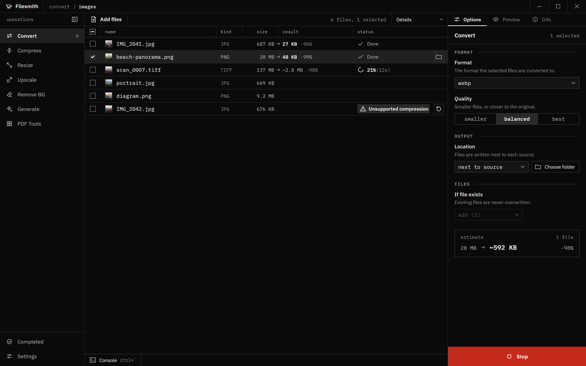

  

Filesmith is a Windows desktop toolkit for everyday file jobs: convert, compress, resize, upscale,
remove backgrounds, generate images, and work with PDFs and archives. Drop in a batch of files, pick
the options and run it. Outputs go next to the sources by default and never overwrite anything. The same
engine is available as the `filesmith` command line, from a built-in console or any terminal.

## Docs

- [Getting started](docs/getting-started.md): install, the main screen, your first job
- [Operations](docs/operations.md): what each operation does and its options
- [Models](docs/models.md): Upscale and Generate models, ComfyUI
- [Command line](docs/cli.md): the `filesmith` CLI and the in-app console
- [Architecture](docs/architecture.md): for developers, how the app is built, tested and shipped

## License

[MIT](LICENSE)
