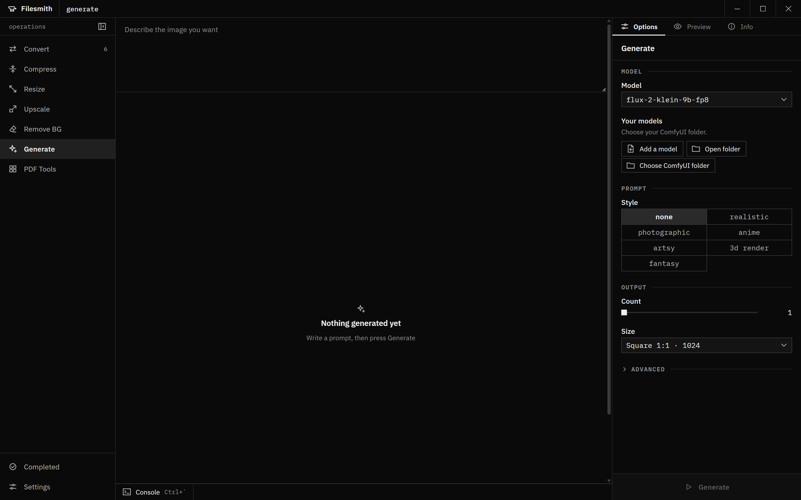

# Operations

What each verb in the rail does: what it accepts, the options in the inspector's
Options tab, their defaults, and what it writes. Labels below match the UI.

## Output naming (all verbs)

Filesmith never overwrites a source or an existing file.

- A file is written next to its source as `name.<new ext>` when that name is free.
- If it is taken, a tag is added: `name (converted).ext`, then `name (converted 2).ext`, and so on.
  The tag is the verb: `converted`, `compressed`, `resized`, `upscaled`, `no-bg`, `text`,
  `pages`, `merged`.
- Operations that produce many files write a new folder, such as `name (pages)`, with
  `name (pages) (2)` on a clash.
- A failed or canceled job leaves nothing behind.
- Every verb except Generate shows a size estimate card under its options once files are queued.

## Convert

Changes format. Works within a family; a file is never offered its own format. A selection
never mixes two families, and the target list only shows formats valid for every selected file.

| Source                                          | Targets                                        | Engine         |
| ----------------------------------------------- | ---------------------------------------------- | -------------- |
| Image                                           | PNG, JPG, WebP, AVIF, JXL, TIFF, BMP, GIF, ICO | ImageMagick    |
| Video                                           | MP4, MKV, MOV, WebM, AVI, GIF                  | ffmpeg         |
| Audio                                           | MP3, M4A, AAC, OGG, OPUS, FLAC, WAV            | ffmpeg         |
| Word doc, plain text, PDF                       | PDF, DOCX, ODT, RTF, TXT, HTML                 | LibreOffice    |
| PDF (extra)                                     | CBZ, CBR, CB7, CBT                             | mutool + 7-Zip |
| Spreadsheet (xlsx, xls, ods, csv, tsv)          | PDF, XLSX, ODS, CSV                            | LibreOffice    |
| Slides (pptx, ppt, odp)                         | PDF, PPTX, ODP                                 | LibreOffice    |
| Archive (zip, rar, 7z, tar, cbz, cbr, cb7, cbt) | CBZ, CBR, CB7, CBT, ZIP, RAR, 7Z, TAR, PDF     | 7-Zip          |

Routing notes:

- PDF to TXT uses mutool and does not need LibreOffice.
- Other document conversions use the LibreOffice copy bundled with the app. If it is missing,
  Filesmith falls back to an installed LibreOffice
  (`winget install TheDocumentFoundation.LibreOffice`).
- Archive to archive is extract and repack. Archive to PDF puts the images in filename
  order, the way a reader shows them.
- PDF to a comic format renders each page to an image, then packs them.
- CBR and RAR output need WinRAR (`Rar.exe`), which cannot be bundled. Without it, those
  targets are greyed out with "WinRAR not found". Reading RAR needs nothing extra.
- Images going to JPG or BMP are flattened onto white. ICO gets sizes 256 to 16.

Options:

| Option         | Shown for               | Choices                                       | Default                                      |
| -------------- | ----------------------- | --------------------------------------------- | -------------------------------------------- |
| Format         | all                     | targets above                                 | WebP for images, else the first valid target |
| Quality        | images                  | smaller, balanced, best                       | balanced                                     |
| Compression    | archive to archive      | store, normal                                 | store                                        |
| Resolution     | PDF to comic            | 72 to 400 dpi                                 | 150 dpi                                      |
| Page format    | PDF to comic            | jpg, png                                      | jpg                                          |
| Page quality   | PDF to comic, jpg pages | 10 to 100                                     | 100                                          |
| Location       | non-archive converts    | next to source, chosen folder (Choose folder) | next to source                               |
| If file exists | non-archive converts    | add (2), the only choice                      | add (2)                                      |

Output: one file per source in the target format, tag `converted`.

## Compress

Shrinks file size. Accepts images (JPG, PNG, WebP, GIF, TIFF, AVIF, JXL), video, audio and PDF.
BMP, HEIC, SVG and other formats that cannot be re-encoded safely are not offered.

| Kind  | Option  | Choices                                    | Default     |
| ----- | ------- | ------------------------------------------ | ----------- |
| Image | Format  | Keep format, WebP, AVIF                    | Keep format |
| Image | Quality | 10 to 100                                  | 80          |
| Video | Codec   | H.264, H.265, AV1                          | H.264       |
| Video | Scale   | 25% to original, step 5                    | original    |
| Video | Quality | 10 to 100                                  | 80          |
| Audio | Codec   | Keep format, MP3, AAC, Opus                | Keep format |
| Audio | Bitrate | 320k, 256k, 192k, 128k, 96k, 64k           | 192k        |
| PDF   | Level   | Lossless, High quality, Balanced, Smallest | Balanced    |
| PDF   | Colour  | Convert to greyscale (checkbox)            | off         |

Output, tag `compressed`:

- Image: same format via CaesiumCLT (or ImageMagick for formats Caesium cannot write), or
  WebP/AVIF via ImageMagick.
- Video: always `.mp4` (ffmpeg). All audio tracks are kept; subtitles are dropped. Below
  original scale the inspector lists each file's exact output pixels.
- Audio: the chosen codec's extension. Keep format on a lossless source (FLAC, WAV, AIFF)
  writes a max-compression FLAC.
- PDF: Lossless runs `mutool clean` (no image changes). Other levels use Ghostscript, which
  downsamples embedded images.

## Resize

Scales images with ImageMagick. Accepts images. Animated GIFs keep their frames.

| Option           | Choices                                        | Default     |
| ---------------- | ---------------------------------------------- | ----------- |
| Mode             | percent, dimensions                            | percent     |
| Percent          | 5% to 200%                                     | 50%         |
| Width and height | numbers; leave one blank to scale by the other | blank       |
| Fit              | keep aspect, stretch                           | keep aspect |

Keep aspect fits inside the box, so one of the two numbers may have no effect; the output
size list shows the real result per file. Stretch uses both numbers.

Output: same format as the source, tag `resized`.

## Upscale

Enlarges images 2x to 4x with AI. Accepts images. Output is always PNG, tag `upscaled`.

| Option   | Choices                                                    | Default              |
| -------- | ---------------------------------------------------------- | -------------------- |
| Factor   | 2×, 3×, 4×                                                 | 4×                   |
| Model    | Real-ESRGAN models found on disk, plus AI models on NVIDIA | Photo                |
| AI model | imported ComfyUI upscalers, PiD (diffusion), 4×            | first imported model |
| GPU mode | full GPU usage, balanced                                   | full GPU usage       |

Engines:

- **Real-ESRGAN (ncnn, Vulkan).** Bundled and works on any Vulkan GPU, including AMD and
  Intel. The Model list is read from disk: Photo, Anime and any other shipped models, plus
  your own. **Add your own model** opens the user models folder; drop in a `.param`/`.bin`
  pair and it appears, marked "added by you".
- **AI models (NVIDIA only).** Shown when an NVIDIA GPU is detected; otherwise the inspector
  says why. Opens a second picker:
  - **ComfyUI upscalers.** Choose your ComfyUI folder once; Filesmith reads
    `models\upscale_models` in place (nothing copied, ComfyUI does not need to run) and loads
    each file with spandrel. Each entry shows its native scale; unverified ones say
    "experimental". See [models.md](models.md).
  - **PiD (diffusion).** Offered only when installed or when its weights can be reused from
    your ComfyUI. The **PiD engine** card downloads about 6 GB once (non-commercial use only);
    **PiD install** removes it. PiD has no GPU mode. Under 12 GB of VRAM it warns that large
    images are reduced to fit.
- **GPU mode.** Balanced caps VRAM and paces the work so other apps stay responsive.

The output size list shows each file's result. Outputs over about 1 GB trigger a warning.

## Remove BG

Cuts the subject out with rembg (BiRefNet model, alpha matting and mask clean-up always on).
Accepts images. Needs the free `uv` tool (`winget install astral-sh.uv`); the first run
downloads the model once (a few hundred MB), then works offline.

| Option           | Choices                                                             | Default     |
| ---------------- | ------------------------------------------------------------------- | ----------- |
| Fill             | Transparent, White, Black, Green screen, Custom Color, Custom Image | Transparent |
| Custom colour    | colour picker (Custom Color)                                        | `#ff0000`   |
| Background image | Choose image (Custom Image)                                         | none        |

Output: PNG, tag `no-bg`. Custom Image composites the cutout over the chosen image.

## Generate

Creates images from a text prompt with your local ComfyUI. Takes no dropped files; the prompt
is typed in the centre. Filesmith attaches to a running ComfyUI or starts its own headless one.
If ComfyUI is not found, a COMFYUI group asks you to locate it.

| Option                          | Choices                                                                                                            | Default                                |
| ------------------------------- | ------------------------------------------------------------------------------------------------------------------ | -------------------------------------- |
| Model                           | image models in your ComfyUI folder                                                                                | first runnable model                   |
| Negative prompt                 | text (hidden for models that ignore it)                                                                            | `blurry, low quality, watermark, text` |
| Style                           | none, realistic, photographic, anime, artsy, 3d render, fantasy                                                    | none                                   |
| Size                            | Square 1:1 · 1024, Portrait 2:3, Landscape 3:2, Portrait 9:16, Landscape 16:9, Portrait 4:5, Landscape 5:4, custom | Square 1:1 · 1024                      |
| Count                           | 1 to 8                                                                                                             | 1                                      |
| Steps (Advanced)                | 1 to 50 (8 to 50 for SDXL, Flux 1)                                                                                 | per model family                       |
| Guidance (CFG) (Advanced, SDXL) | 1 to 15                                                                                                            | 7                                      |
| Guidance (Advanced, Flux)       | 1 to 10                                                                                                            | 3.5 for Flux 1                         |
| Seed (Advanced)                 | number, or Random seed                                                                                             | random                                 |

Model setup:

- **Your models** lists the folder, with **Add a model** (import a ComfyUI "Export (API)"
  workflow), **Open folder** and **Change ComfyUI folder**.
- A model missing its text encoder or VAE shows **Required files** with
  **Download required files**.
- An unrecognised model can be run with **Try anyway**.
- Changing to a different model family resets Steps and Guidance to that family's defaults.

Output: PNG named from the start of the prompt (`a-red-fox.png`, tag `generated`), saved to
your Downloads folder.

## PDF Tools

A grid of one-off PDF cards. Each card is one operation and accepts PDFs.

| Card           | Does                            | Options (default)                        | Output                                                                                |
| -------------- | ------------------------------- | ---------------------------------------- | ------------------------------------------------------------------------------------- |
| Extract text   | Saves the text layer            | none                                     | `name.txt` (tag `text`)                                                               |
| Pages to PNG   | Renders each page               | Resolution, 72 to 400 dpi (150 dpi)      | folder `name (pages)` with `page-1.png`, ...                                          |
| Merge          | Combines 2+ PDFs in table order | none; needs 2 or more PDFs               | one PDF named after the first (tag `merged`)                                          |
| Split          | Keeps only the listed pages     | Pages to keep, e.g. `1-3,5,8-10` (empty) | `name (pages).pdf`                                                                    |
| Burst          | Saves every page separately     | none                                     | folder `name (split)` with `name-1.pdf`, ... (zero-padded to the page count's digits) |
| Extract images | Pulls out embedded images       | none                                     | folder `name (images)`; fails if the PDF has none                                     |

All cards use mutool, which is bundled.
